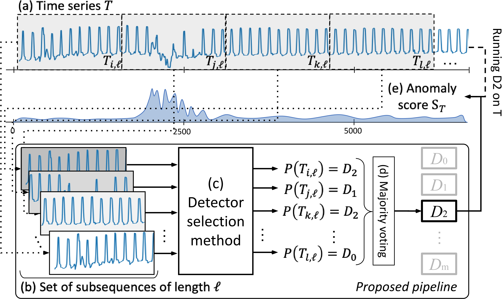
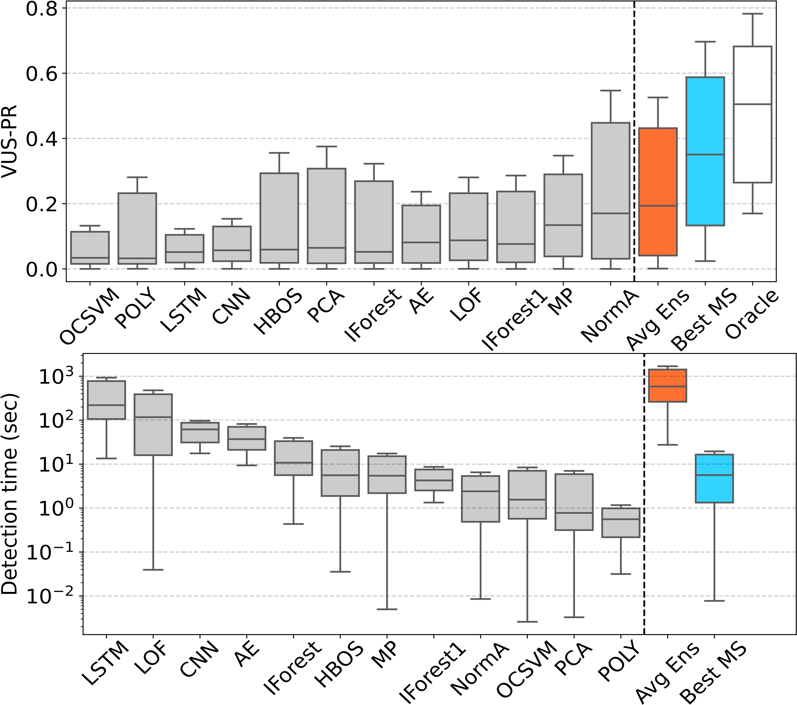

<p align="center">

</p>

<h1 align="center">Choose Wisely
</h1>
<h2 align="center">An Extensive Evaluation of Model Selection for Anomaly Detection in Time Series</h2>

<div align="center">
<p>
 
</p>
</div>

<p align="center"><a href="https://adecimots.streamlit.app/"><strong>Adecimo</strong>: Explore our results and test with your own data</a></p>

MSAD proposes a pipeline for model selection based on time series classification and an extensive experimental evaluation of existing classification algorithms for this new pipeline. Our results demonstrate that model selection methods outperform every single anomaly detection method while being in the same order of magnitude regarding execution time. You can click on our demo link above to get more information and navigate through our experimental evaluation.

If you use MSAD in your project or research, please cite the following paper:

- [VLDB, 2023](https://dl.acm.org/doi/abs/10.14778/3611479.3611536)

### Reference

> Sylligardos, Emmanouil, et al. "Choose Wisely: An Extensive Evaluation of Model Selection for Anomaly Detection in Time Series." Proceedings of the VLDB Endowment 16.11 (2023): 3418-3432.

```bibtex
@article{sylligardos2023choose,
  title={Choose Wisely: An Extensive Evaluation of Model Selection for Anomaly Detection in Time Series},
  author={Sylligardos, Emmanouil and Boniol, Paul and Paparrizos, John and Trahanias, Panos and Palpanas, Themis},
  journal={Proceedings of the VLDB Endowment},
  volume={16},
  number={11},
  pages={3418--3432},
  year={2023},
  publisher={VLDB Endowment}
}
```

## Contributors

- **Emmanouil Sylligardos** (ICS-FORTH)
- **Paul Boniol** (Université Paris Cité)

## Installation

To install MSAD from source, you will need the following tools:

- `git`
- `conda` (anaconda or miniconda)

#### Steps for installation

**Step 1:** Clone this repository using `git` and change into its root directory.

```bash
git clone https://github.com/boniolp/MSAD.git
cd MSAD/
```

**Step 2:** Download the required datasets and weights from the following links (due to upload size limitations on GitHub, we host them on Google Drive):

- [Download datasets](https://drive.google.com/file/d/1PQKwu5lZTnTmsmms1ipko9KF712Oc5DE/view?usp=sharing)

  - Move the downloaded file `TSB.zip` into the `MSAD/data/` directory and unzip it.

- [Download datasets + preprocesed data](https://drive.google.com/file/d/1KBFzKE3Z-tUe_3KdI6gxnfjbMc0ampr6/view?usp=sharing)

  - Unzip the downloaded `data.zip` file and move its contents into the `MSAD/data/` directory. With this files you can skip the steps of generating the Oracles, and creating the proccesed datasets (windowed and features).

- [Download weights](https://drive.google.com/file/d/1qMfSTPXVT2XkwHkwuRE26mo19FKXrf60/view?usp=sharing)

  - Unzip the downloaded `weights.zip` file and move its contents (`supervised/` and `unsupervised/`) into the `MSAD/results/weights/` directory.

**Step 3:** Create and activate a `conda` environment named `MSAD`.

```bash
conda env create --file environment.yml
conda activate MSAD
```

> Note: If you plan to use GPU acceleration, please ensure that you have CUDA installed. You can refer to the [CUDA installation instructions](https://developer.nvidia.com/cuda-downloads) for guidance.

If you do not wish to create the `conda` environment, you can install only the dependencies listed in `requirements.txt` using the following command:

```
pip install -r requirements.txt
```

**4.** :clap: Installation complete! :clap:

## Usage

Below, you will find a step-by-step guide on how to use our work. This includes the commands required to run the scripts along with a small explanation of what they do and the parameters they use. The values of the parameters in the scripts are just examples, and you can experiment with different values.

#### Compute Oracle

The Oracle (shown in white in the results figure at the end) is a hypothetical model that simulates the accuracy of a model on a given benchmark and evaluates its anomaly detection ability. You can simulate Oracle with different accuracy values, ranging from 1 (always selecting the best detector for a time series) to zero (always selecting a wrong detector). Additionally, you can simulate Oracle with different modes of randomness, namely:

1. **true**: When wrong, randomly select another detector.
2. **lucky**: When wrong, always select the second best detector (upper bound).
3. **unlucky**: When wrong, always select the worst detector (lower bound).
4. **best-k**: When wrong, always select the k-th best detector (e.g., best-2 is lucky).

To compute Oracle, run the following command:

```bash
python3 run_oracle.py --path=data/TSB/metrics/ --acc=1 --randomness=true
```

- path: Path to metrics (the results will be saved here).
- acc: The accuracy that you want to simulate (a float between 0 and 1).
- randomness: The randomness mode that you want to simulate (see possible modes above).

> The results are saved in _/MSAD/data/TSB/metrics/TRUE_ORACLE-100/_ (the name of the last folder should change depending on the parameters).

#### Compute Averaging Ensemble

The Averaging Ensemble, or Avg Ens (in orange in the results figure at the end), is used to ensemble the anomaly scores produced by all the detectors, by computing their average. Subsequently, the AUC-PR and the VUS-PR metrics are computed for the resulting score.

To compute Avg Ens, run the following command:

```bash
python3 run_avg_ens.py --n_jobs=16
```

- n_jobs: The number of threads to use for parallel computation (specify an appropriate value).

> This process may take some time :smile: (~16 mins in 16 cores and 32GB of RAM). The script will perform the following tasks:
>
> 1. Load all datasets from the TSB benchmark
> 2. Load all the scores for each time series and detector (~ 1800 \* 12 scores)
> 3. Compute the average score for each time series for 4 metrics (AUC-ROC, AUC-PR, VUS-ROC, VUS-PR)
> 4. Save the results in _/MSAD/data/TSB/metrics/AVG_ENS/_.

#### Data Preprocessing

Our models have been implemented to work with fixed-size inputs. Thus, before running any models, we first divide every time series in the TSB benchmark into windows. Note that you can add your own time series here and divide them into windows, but make sure to follow the same format.

To produce a windowed dataset, run the following command:

```bash
python3 create_windows_dataset.py --save_dir=data/ --path=data/TSB/data/ --metric_path=data/TSB/metrics/ --window_size=512 --metric=AUC_PR
```

- save_dir: Path to save the dataset.
- path: Path of the dataset to divide into windows.
- metric_path: Path to the metrics of the dataset provided (to produce the labels).
- window_size: Window size (if the window size is larger than the time series' length, that time series is skipped).
- metric: Metric to use for producing the labels (AUC-PR, VUS-PR, AUC-ROC, VUS-ROC).

The feature-based methods require a set of features to be computed first, turning the time series into tabular data. To achieve this, we use the TSFresh module, which computes a predefined set of features.

To compute the set of features for a segmented dataset, run the following command:

```bash
python3 generate_features.py --path=data/TSB_512/
```

- path: Path to the dataset for computing the features (the dataset should be segmented first into windows; see the command above). The resulting dataset is saved in the same directory (**MANDATORY**).

> Note: This process is memory-intensive, and we required a minimum of 512GB of RAM to run it. If you encounter memory issues, optimizing the TSFresh library is not within the scope of this project.

#### Deep Learning Architectures

To train a model, run the following command:

```bash
python3 train_deep_model.py --path=data/TSB_512/ --split=0.7 --file=experiments/supervised_splits/split_TSB_512.csv --model=resnet --params=models/configuration/resnet_default.json --batch=256 --epochs=10 --eval-true
```

- path: Path to the dataset to use.
- split: Split percentage for training and validation sets.
- seed: Seed for train/val split (optional).
- file: Path to a file that contains a specific split (to reproduce our results).
- model: Model to use (type of architecture).
- params: A JSON file with the model's parameters.
- batch: Batch size.
- epochs: Number of training epochs.
- eval-true: Whether to evaluate the model on test data after training.

> This script will save the following:
>
> - training specific information into _/MSAD/results/done_training/resnet_default_512_11092023_162841.csv_ file.
> - TensorBoard data will be saved into _/MSAD/results/runs/resnet_default_512_11092023_162726/_.
> - The trained weights will be saved in _/MSAD/results/weights/resnet_default_512/_.
> - In case the 'eval-true' is selected, the results of the trained model on the test set will be saved in _/MSAD/results/raw_predictions/resnet_512_preds.csv_.

To evaluate a model on a folder of CSV files, run the following command:

```bash
python3 eval_deep_model.py --data=data/TSB_512/MGAB/ --model=convnet --model_path=results/weights/supervised/convnet_default_512/model_30012023_173428 --params=models/configuration/convnet_default.json --path_save=results/raw_predictions/
```

- data: Path to the time series data to predict.
- model: Model to use.
- model_path: Path to the trained model.
- params: A JSON file with the model's parameters.
- path_save: Path to save the results.

> The results of the above inference example are saved in _/MSAD/results/raw_predictions/convnet_512_preds.csv_.

To reproduce our specific results, run the following command:

```bash
python3 eval_deep_model.py --data=data/TSB_512/ --model=convnet --model_path=results/weights/supervised/convnet_default_512/model_30012023_173428 --params=models/configuration/convnet_default.json --path_save=results/raw_predictions/ --file=experiments/supervised_splits/split_TSB_512.csv
```

- file: Path to a file that contains a specific split (to reproduce our results).

#### Rocket

To train a Rocket model, run the following command:

```bash
python3 train_rocket.py --path=data/TSB_512/ --split_per=0.7 --file=experiments/supervised_splits/split_TSB_512.csv --eval-true --path_save=results/weights/supervised/
```

- path: Path to the dataset to use.
- split_per: Split percentage for training and validation sets.
- seed: Seed for splitting training and validation sets (use a small number for reproducibility).
- file: Path to a file that contains a specific split (if needed).
- eval-true: Whether to evaluate the model on test data after training.
- path_save: Path to save the trained classifier.

> This process may take some time :smile: (~5 mins in 16 cores and 32GB of RAM). If 'eval-true' is selected, the results of the inference of the trained model will be saved in _/MSAD/results/raw_predictions/rocket_512_preds.csv_

To evaluate a Rocket model, run the following command:

```bash
python3 eval_rocket.py --data=data/TSB_512/KDD21/ --model_path=results/weights/supervised/rocket_512/ --path_save=results/raw_predictions/
```

- data: Path to the time series data to predict.
- model_path: Path to the trained model.
- path_save: Path to save the results.

#### Feature-Based

List of available classifiers:

- **knn**
- **svc_linear**
- **decision_tree**
- **random_forest**
- **mlp**
- **ada_boost**
- **bayes**
- **qda**

To train any of these classifiers, run the following command:

```bash
python3 train_feature_based.py --path=data/TSB_512/TSFRESH_TSB_512.csv --classifier=knn --split_per=0.7 --file=experiments/unsupervised_splits/unsupervised_testsize_1_split_0.csv --eval-true --path_save=results/weights/
```

- path: Path to the dataset to use.
- classifier: Classifier to run.
- split_per: Split percentage for training and validation sets.
- seed: Seed for splitting training and validation sets (use a small number for reproducibility).
- file: Path to a file that contains a specific split (if needed).
- eval-true: Whether to evaluate the model on test data after training.
- path_save: Path to save the trained classifier.

To evaluate a classifier, run the following command:

```bash
python3 eval_feature_based.py --data=data/TSB_512/TSFRESH_TSB_512.csv --model=knn --model_path=results/weights/knn_512/ --path_save=results/raw_predictions/
```

- data: Path to the time series data to predict.
- classifier: Classifier to run from the list above.
- classifier_path: Path to the trained classifier model.
- path_save: Path to save the results.

> Note: To reproduce our results run the training script with the 'eval-true' option and the 'file' argument set to the specific splits we used (found in the _/MSAD/experiments/\*\_splits_ directories).

## Model Selection Pipeline

We propose a benchmark and an evaluation of 16 time series classifiers used as model selection methods (with 12 anomaly detectors to be selected) applied on 16 datasets from different domains. Our pipeline can be summarized in the following figure.



In the following section, we describe the datasets, anomaly detectors, and time series classification methods considered in our benchmark and evaluation.

### Datasets

We first use the TSB-UAD benchmark (16 public datasets from heterogeneous domains).
Briefly, TSB-UAD includes the following datasets:

| Dataset                      |                                                                                                                                    Description                                                                                                                                    |
| :--------------------------- | :-------------------------------------------------------------------------------------------------------------------------------------------------------------------------------------------------------------------------------------------------------------------------------: |
| Dodgers                      |                                                             is a loop sensor data for the Glendale on-ramp for the 101 North freeway in Los Angeles and the anomalies represent unusual traffic after a Dodgers game.                                                             |
| ECG                          |                        is a standard electrocardiogram dataset and the anomalies represent ventricular premature contractions. We split one long series (MBA_ECG14046) with length ∼ 1e7) to 47 series by first identifying the periodicity of the signal.                        |
| IOPS                         |                                                                             is a dataset with performance indicators that reflect the scale, quality of web services, and health status of a machine.                                                                             |
| KDD21                        |                                                                                             is a composite dataset released in a recent SIGKDD 2021 competition with 250 time series.                                                                                             |
| MGAB                         |                                                     is composed of Mackey-Glass time series with non-trivial anomalies. Mackey-Glass time series exhibit chaotic behavior that is difficult for the human eye to distinguish.                                                     |
| NAB                          |                         is composed of labeled real-world and artificial time series including AWS server metrics, online advertisement clicking rates, real time traffic data, and a collection of Twitter mentions of large publicly-traded companies.                          |
| SensorScope                  |                                                               is a collection of environmental data, such as temperature, humidity, and solar radiation, collected from a typical tiered sensor measurement system.                                                               |
| YAHOO                        |                                                          is a dataset published by Yahoo labs consisting of real and synthetic time series based on the real production traffic to some of the Yahoo production systems.                                                          |
| Daphnet                      |                                                     contains the annotated readings of 3 acceleration sensors at the hip and leg of Parkinson’s disease patients that experience freezing of gait (FoG) during walking tasks.                                                     |
| GHL                          |                                                   is a Gasoil Heating Loop Dataset and contains the status of 3 reservoirs such as the temperature and level. Anomalies indicate changes in max temperature or pump frequency.                                                    |
| Genesis                      |                                                                                  is a portable pick-and-place demonstrator which uses an air tank to supply all the gripping and storage units.                                                                                   |
| MITDB                        |                                                        contains 48 half-hour excerpts of two-channel ambulatory ECG recordings, obtained from 47 subjects studied by the BIH Arrhythmia Laboratory between 1975 and 1979.                                                         |
| OPPORTUNITY (OPP)            | is a dataset devised to benchmark human activity recognition algorithms (e.g., classiffication, automatic data segmentation, sensor fusion, and feature extraction). The dataset comprises the readings of motion sensors recorded while users executed typical daily activities. |
| Occupancy                    |                               contains experimental data used for binary classiffication (room occupancy) from temperature, humidity, light, and CO2. Ground-truth occupancy was obtained from time stamped pictures that were taken every minute.                                |
| SMD (Server Machine Dataset) |                                                                     is a 5-week-long dataset collected from a large Internet company. This dataset contains 3 groups of entities from 28 different machines.                                                                      |
| SVDB                         |                                                                    includes 78 half-hour ECG recordings chosen to supplement the examples of supraventricular arrhythmias in the MIT-BIH Arrhythmia Database.                                                                     |

The figure below shows some typical outliers in these datasets.


You may find more details (and the references) in the TSB-UAD benchmark [paper](https://www.paparrizos.org/papers/PaparrizosVLDB22a.pdf).

### Anomaly Detectors

We use 12 anomaly detection methods proposed for univariate time series. the following table lists and describes the methods considered:

| Anomaly Detection Method                  |                                                                                                    Description                                                                                                     |
| :---------------------------------------- | :----------------------------------------------------------------------------------------------------------------------------------------------------------------------------------------------------------------: |
| Isolation Forest (IForest)                |                              This method constructs the binary tree based on the space splitting and the nodes with shorter path lengths to the root are more likely to be anomalies.                              |
| The Local Outlier Factor (LOF)            |                                                                  This method computes the ratio of the neighboring density to the local density.                                                                   |
| The Histogram-based Outlier Score (HBOS)  |                                      This method constructs a histogram for the data and the inverse of the height of the bin is used as the outlier score of the data point.                                      |
| Matrix Profile (MP)                       |                                                             This method calculates as anomaly the subsequence with the most significant 1-NN distance.                                                             |
| NORMA                                     |                                        This method identifies the normal pattern based on clustering and calculates each point's effective distance to the normal pattern.                                         |
| Principal Component Analysis (PCA)        |                              This method projects data to a lower-dimensional hyperplane, and data points with a significant distance from this plane can be identified as outliers.                               |
| Autoencoder (AE)                          |                        This method projects data to the lower-dimensional latent space and reconstructs the data, and outliers are expected to have more evident reconstruction deviation.                         |
| LSTM-AD                                   | This method build a non-linear relationship between current and previous time series (using Long-Short-Term-Memory cells), and the outliers are detected by the deviation between the predicted and actual values. |
| Polynomial Approximation (POLY)           |   This method build a non-linear relationship between current and previous time series (using polynomial decomposition), and the outliers are detected by the deviation between the predicted and actual values.   |
| CNN                                       | This method build a non-linear relationship between current and previous time series (using convolutional Neural Network), and the outliers are detected by the deviation between the predicted and actual values. |
| One-class Support Vector Machines (OCSVM) |                                                                          This method fits the dataset to find the normal data's boundary.                                                                          |

You may find more details (and the references) in the TSB-UAD benchmark [paper](https://www.paparrizos.org/papers/PaparrizosVLDB22b.pdf).

### Time Series Classification Algorithms

We consider 16 time series classification (TSC) algtorithms used as model selection. the following table lists and describes the methods considered:

| TSC (as model seleciton) |                                                                    Description                                                                    |
| :----------------------- | :-----------------------------------------------------------------------------------------------------------------------------------------------: |
| SVC                      |                          maps training examples to points in space so as to maximize the gap between the two categories.                          |
| Bayes                    |                  uses Bayes’ theorem to predict the class of a new data point using the posterior probabilities for each class.                   |
| MLP                      |                                              consists of multiple layers of interconnected neurons.                                               |
| QDA                      |                                         is a discriminant analysis algorithm for classification problems.                                         |
| Adaboost                 |                                        is a meta-algorithm using boosting technique with weak classifiers.                                        |
| Descision Tree           |                              is a tree-based approach that split data point into different leaves based on feature.                               |
| Random Forest            |              is an ensemble Decision Trees fed with random sample (with replacement) of the training set and random set of features.              |
| kNN                      |                                           assigns the most common class among its k nearest neighbors.                                            |
| Rocket                   |     transforms input time series using a small set of convolutional kernels, and uses the transformed features to train a linear classifier.      |
| ConvNet                  |                 uses convolutional layers to automatically and adaptively learn spatial hierarchies of features from input data.                  |
| ResNet                   |                                        is a ConvNet with residual connections between convolutional block.                                        |
| InceptionTime            |                                            is a combination of ResNets with kernels of multiple sizes.                                            |
| SIT-conv                 |                                        is a transformer architecture with a convolutional layer as input.                                         |
| SIT-linear               | is a transformer architecture for which the time series are divided into non-overlapping patches and linearly projected into the embedding space. |
| SIT-stem                 |                         is a transformer architecture with convolutional layers with increasing dimensionality as input.                          |
| SIT-stem-ReLU            |                                                   is similar to SIT-stem but with Scaled ReLU.                                                    |

## Overview of the results

In the following figure, we present a visual summary of the average VUS-PR and Detection time (i.e., predicting the detector to run and running it) for the components:

- **All Detectors** (in grey): This category represents the individual detectors.
- **Oracle** (in white): The Oracle represents the theoretical best model selection methods.
- **Averaging Ensembling** (in orange): The Averaging Ensembling approach.
- **Best Time Series Classification** (in blue): The best-performing time series classification model used for model selection.



- The detailed comparisons and reproducible experiments are described in the [experiments/accuracy_analysis](https://github.com/boniolp/MSAD/tree/main/experiments/accuracy_analysis) notebook.
- A summarized overview of the results can be found in this [demo](https://adecimots.streamlit.app/).
- For comprehensive accuracy tables (VUS-PR and AUC-PR), please refer to the [accuracy results directory](https://github.com/boniolp/MSAD/tree/main/results/accuracy).
- Detailed execution time tables, including training, prediction, and inference times, can be found in the [execution time results directory](https://github.com/boniolp/MSAD/tree/main/results/execution_time).
