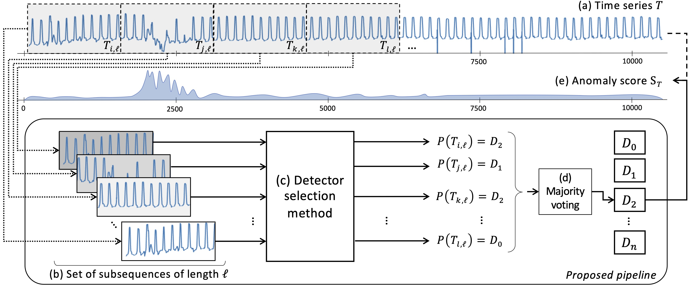
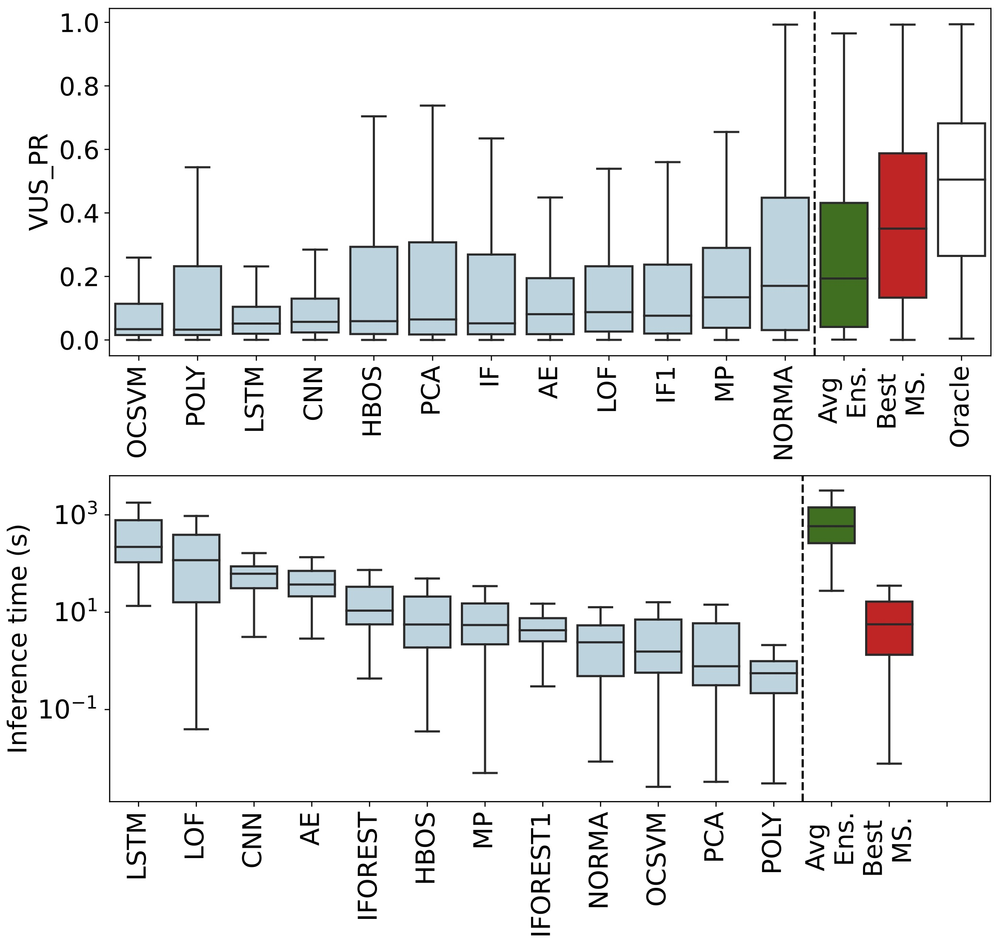

<p align="center">

</p>


<h1 align="center">MSAD</h1>
<h2 align="center">Model Selection for Anomaly Detection in Time Series</h2>

<div align="center">
<p>
 
</p>
</div>


<p align="center"><a href="https://adecimots.streamlit.app/">Try our demo</a></p>

MSAD proposes a pipeline for model selection based on time series classification and an extensive experimental evaluation of existing classification algorithms for this new pipeline. Our results demonstrate that model selection methods outperform every single anomaly detection method while being in the same order of magnitude regarding execution time. You can click on our demo link above to get more information and navigate through our experimental evaluation.


## Contributors

* Emmanouil Sylligardos (ICS-FORTH)
* Paul Boniol (Université Paris Cité)

## Installation

The following tools are required to install MSAD from source:

- git
- conda (anaconda or miniconda)

#### Steps

1. First, due to limitations in the upload size on GitHub, we host the datasets and pretrained models at a different location. Please download the datasets using the following links:

- datasets: https://drive.google.com/file/d/1PQKwu5lZTnTmsmms1ipko9KF712Oc5DE/view?usp=share_link

- models: https://drive.google.com/file/d/1sQeqVZSBUuaJrvsueLtjLhACbARFS2dx/view?usp=sharing

Unzip the files and move the datasets (i.e., TSB/ folder) in data/, and move the models files (i.e., the contents of the unzipped file called weight) in weights/ folder in the repo.

2. Clone this repository using git and change into its root directory.

```bash
git clone https://github.com/boniolp/MSAD.git
cd MSAD/
```

3. Create and activate a conda-environment 'MSAD'.

```bash
conda env create --file environment.yml
conda activate MSAD
```
   
4. Install the dependencies from `requirements.txt`:
```
pip install -r requirements.txt
```

## Model Selection Pipeline

We propose a benchmark and an evaluation of 16 time series classifiers used as model selection methods (with 12 anomaly detectors to be selected) applied on 16 datasets from different domains. Our pipeline can be summarized in the following figure.

<p align="center">

</p>

In the following section, we describe the datasets, anomaly detectors, and time series classification methods considered in our benchmark and evaluation.

### Datasets 

We first use the TSB-UAD benchmark (16 public datasets from heterogeneous domains).
Briefly, TSB-UAD includes the following datasets:

| Dataset    | Description|
|:--|:---------:|
|Dodgers| is a loop sensor data for the Glendale on-ramp for the 101 North freeway in Los Angeles and the anomalies represent unusual traffic after a Dodgers game.|
|ECG| is a standard electrocardiogram dataset and the anomalies represent ventricular premature contractions. We split one long series (MBA_ECG14046) with length ∼ 1e7) to 47 series by first identifying the periodicity of the signal.|
|IOPS| is a dataset with performance indicators that reflect the scale, quality of web services, and health status of a machine.|
|KDD21| is a composite dataset released in a recent SIGKDD 2021 competition with 250 time series.|
|MGAB| is composed of Mackey-Glass time series with non-trivial anomalies. Mackey-Glass time series exhibit chaotic behavior that is difficult for the human eye to distinguish.|
|NAB| is composed of labeled real-world and artificial time series including AWS server metrics, online advertisement clicking rates, real time traffic data, and a collection of Twitter mentions of large publicly-traded companies.|
|SensorScope| is a collection of environmental data, such as temperature, humidity, and solar radiation, collected from a typical tiered sensor measurement system.|
|YAHOO| is a dataset published by Yahoo labs consisting of real and synthetic time series based on the real production traffic to some of the Yahoo production systems.|
|Daphnet| contains the annotated readings of 3 acceleration sensors at the hip and leg of Parkinson’s disease patients that experience freezing of gait (FoG) during walking tasks.|
|GHL| is a Gasoil Heating Loop Dataset and contains the status of 3 reservoirs such as the temperature and level. Anomalies indicate changes in max temperature or pump frequency.|
|Genesis| is a portable pick-and-place demonstrator which uses an air tank to supply all the gripping and storage units.|
|MITDB| contains 48 half-hour excerpts of two-channel ambulatory ECG recordings, obtained from 47 subjects studied by the BIH Arrhythmia Laboratory between 1975 and 1979.|
|OPPORTUNITY (OPP)| is a dataset devised to benchmark human activity recognition algorithms (e.g., classiffication, automatic data segmentation, sensor fusion, and feature extraction). The dataset comprises the readings of motion sensors recorded while users executed typical daily activities.|
|Occupancy| contains experimental data used for binary classiffication (room occupancy) from temperature, humidity, light, and CO2. Ground-truth occupancy was obtained from time stamped pictures that were taken every minute.|
|SMD (Server Machine Dataset)| is a 5-week-long dataset collected from a large Internet company. This dataset contains 3 groups of entities from 28 different machines.|
|SVDB| includes 78 half-hour ECG recordings chosen to supplement the examples of  supraventricular arrhythmias in the MIT-BIH Arrhythmia Database.|

The figure below shows some typical outliers in these datasets.

<p align="center">

</p>

You may find more details (and the references) in the TSB-UAD benchmark [paper](https://www.paparrizos.org/papers/PaparrizosVLDB22a.pdf).

### Anomaly Detectors

We use 12 anomaly detection methods proposed for univariate time series. the following table lists and describes the methods considered:

| Anomaly Detection Method    | Description|
|:--|:---------:|
|Isolation Forest (IForest) | This method constructs the binary tree based on the space splitting and the nodes with shorter path lengths to the root are more likely to be anomalies. |
|The Local Outlier Factor (LOF)| This method computes the ratio of the neighboring density to the local density. |
|The Histogram-based Outlier Score (HBOS)| This method constructs a histogram for the data and the inverse of the height of the bin is used as the outlier score of the data point. |
|Matrix Profile (MP)| This method calculates as anomaly the subsequence with the most significant 1-NN distance. |
|NORMA| This method identifies the normal pattern based on clustering and calculates each point's effective distance to the normal pattern. |
|Principal Component Analysis (PCA)| This method projects data to a lower-dimensional hyperplane, and data points with a significant distance from this plane can be identified as outliers. |
|Autoencoder (AE)|This method projects data to the lower-dimensional latent space and reconstructs the data, and outliers are expected to have more evident reconstruction deviation. |
|LSTM-AD| This method build a non-linear relationship between current and previous time series (using Long-Short-Term-Memory cells), and the outliers are detected by the deviation between the predicted and actual values. |
|Polynomial Approximation (POLY)| This method build a non-linear relationship between current and previous time series (using polynomial decomposition), and the outliers are detected by the deviation between the predicted and actual values. |
| CNN | This method build a non-linear relationship between current and previous time series (using convolutional Neural Network), and the outliers are detected by the deviation between the predicted and actual values. |
|One-class Support Vector Machines (OCSVM)| This method fits the dataset to find the normal data's boundary. |

You may find more details (and the references) in the TSB-UAD benchmark [paper](https://www.paparrizos.org/papers/PaparrizosVLDB22b.pdf).

### Time Series Classification Algorithms

We consider 16 time series classification (TSC) algtorithms used as model selection. the following table lists and describes the methods considered:

| TSC  (as model seleciton)  | Description|
|:--|:---------:|
| SVC | maps training examples to points in space so as to maximize the gap between the two categories. |
| Bayes | uses Bayes’ theorem to predict the class of a new data point using the posterior probabilities for each class. |
| MLP | consists of multiple layers of interconnected neurons. |
| QDA | is a discriminant analysis algorithm for classification problems. |
| Adaboost | is a meta-algorithm using boosting technique with weak classifiers. |
| Descision Tree | is a tree-based approach that split data point into different leaves based on feature. |
| Random Forest  | is an ensemble Decision Trees fed with random sample (with replacement) of the training set and random set of features. |
| kNN | assigns the most common class among its k nearest neighbors. |
| Rocket | transforms input time series using a small set of convolutional kernels, and uses the transformed features to train a linear classifier. |
| ConvNet  | uses convolutional layers to automatically and adaptively learn spatial hierarchies of features from input data. |
| ResNet | is a ConvNet with residual connections between convolutional block. |
| InceptionTime | is a combination of ResNets with kernels of multiple sizes. |
| SIT-conv | is a transformer architecture with a convolutional layer as input. |
| SIT-linear | is a transformer architecture for which the time series are divided into non-overlapping patches and linearly projected into the embedding space. |
| SIT-stem | is a transformer architecture with convolutional layers with increasing dimensionality as input. |
| SIT-stem-ReLU | is similar to SIT-stem but with Scaled ReLU. |


## Overview of the results


We report in the following figure the average VUS-PR and inference time (i.e., predicting the detector to run and running it) for all detectors, the Oracle (the theoretical best model selection methods, in white), the Averaging Ensembling (in green), and the best time series classification used as model selection (in red). 

<p align="center">

</p>

This figure and many others comparisons are described (and reproductible) in [these notebook](https://github.com/boniolp/MSAD/tree/main/experiments/accuracy_analysis), summarized in [this document](TODO).
The overall accuracy tables (for VUS-PR and AUC-PR) are [here](https://github.com/boniolp/MSAD/tree/main/results/accuracy), and the execution time tables (training, prediction, and inference) are [here](https://github.com/boniolp/MSAD/tree/main/results/execution_time).


## Usage


## References

